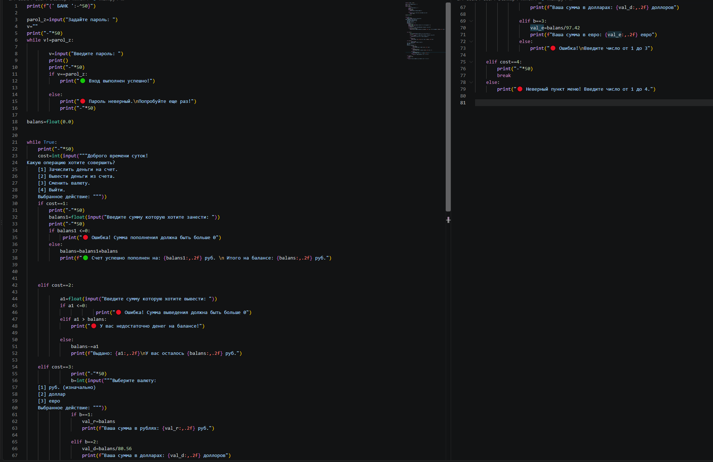
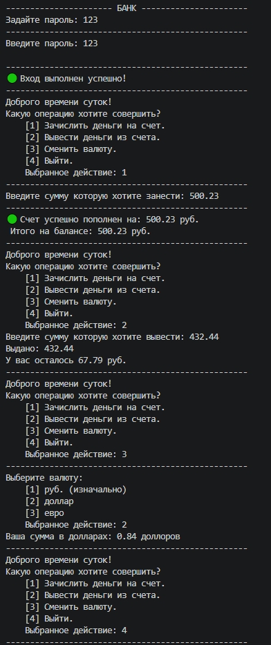
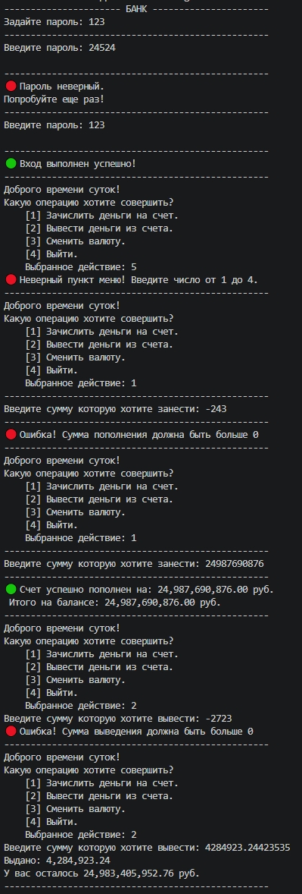
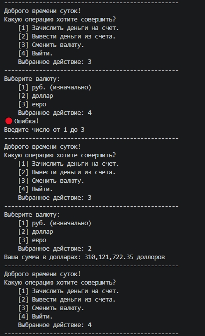

# python-console-bank
Консольное приложение «Банкомат» с авторизацией, операциями пополнения/снятия и конвертацией валют.

# 🏦 Console Bank Application (Python)

Интерактивное консольное приложение, имитирующее работу банковского терминала с авторизацией и финансовыми операциями.

## 🛠 Функционал
- 🔐 **Аутентификация:** защита входа по паролю через цикл `while`.
- 💳 **Управление балансом:** пополнение и снятие средств с валидацией (защита от ввода отрицательных сумм и снятия больше имеющегося баланса).
- 💱 **Мультивалютный счет:** конвертация текущего баланса в USD и EUR.
- 🎨 **Форматирование данных:** выравнивание текста, разделение тысяч и фиксирование копеек (`:,.2f`).

## 💻 Технологии
- Python 
- Управляющие конструкции: `while`, `if / elif / else`
- Форматирование строк: `f-strings`

## 📸 Скриншот работы





## 🚀 Запуск проекта
1. Установите Python 3.
2. Скачайте файл `main.py`.
3. Запустите файл через терминал/IDE:
   ```bash
   python main.py
